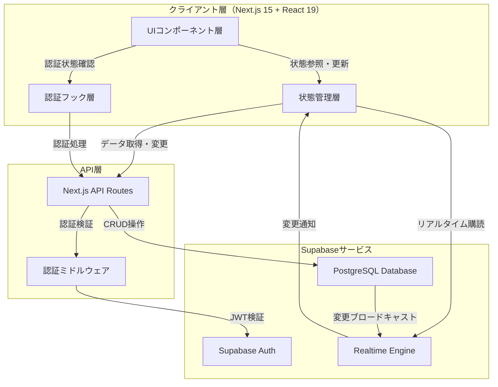
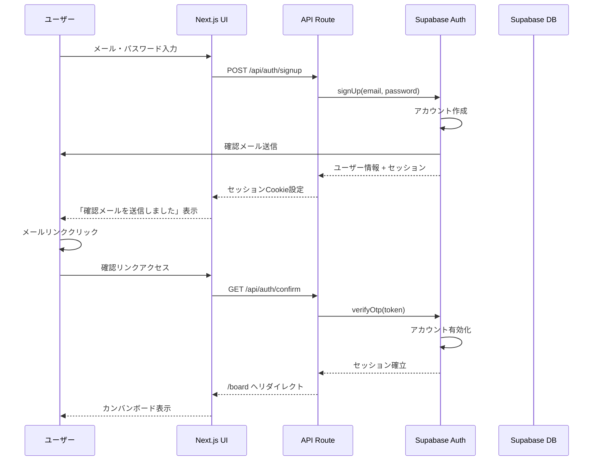
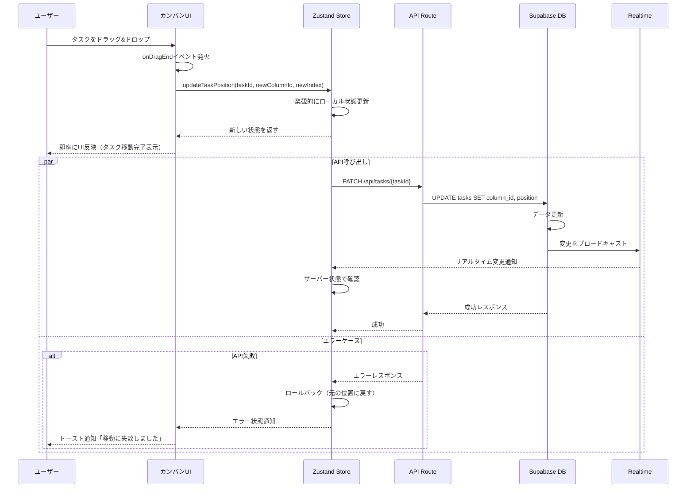
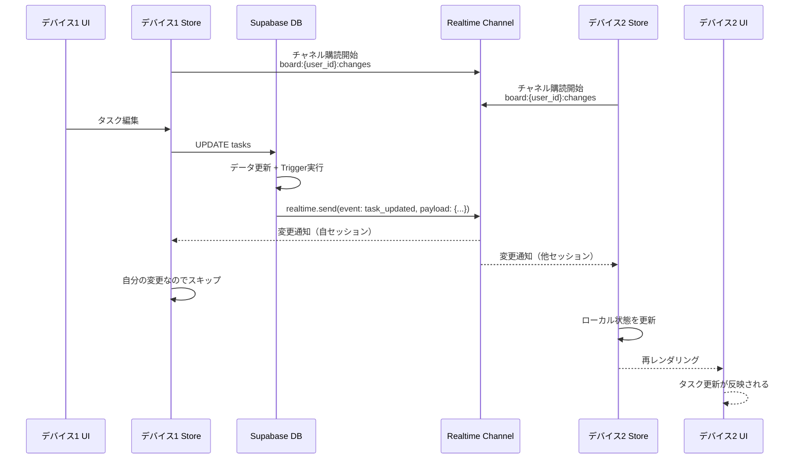
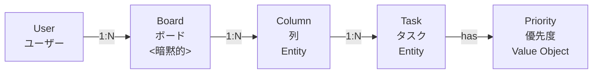

# 技術設計書

## Overview

本機能は、Supabaseをバックエンドとして使用するカンバンボード式ToDoタスク管理Webアプリケーションを提供します。ユーザーは直感的なドラッグ&ドロップ操作でタスクを管理し、リアルタイムでの変更同期により複数デバイス間でシームレスな体験を実現します。

**Purpose**: 個人およびチームのタスク管理を視覚化し、進捗状況を一目で把握できる環境を提供することで、プロジェクト管理の効率を向上させます。

**Users**: 個人のタスク管理を行うユーザー、および将来的には小規模チームでの協働作業を行うユーザーが、タスクの作成・編集・ステータス変更・検索といった日常的なワークフローで利用します。

### Goals

- Supabase Authを活用した安全なユーザー認証システムの実装
- @hello-pangea/dndライブラリによる直感的なドラッグ&ドロップ体験の提供
- Supabaseリアルタイムサブスクリプションによる複数デバイス間での即時データ同期
- レスポンシブデザインによるデスクトップ・モバイル両対応
- 成功基準: 認証からタスク作成・移動・削除までの基本フロー完了時間3秒以内

### Non-Goals

- 複雑なチーム管理機能（ロール管理、権限制御）は初期バージョンでは対象外
- タスクの添付ファイル機能は将来の拡張として位置づけ
- サードパーティカレンダー統合は現在のスコープ外
- タスクの自動化・ワークフロー機能は今回実装しない

## Architecture

### High-Level Architecture



### Technology Stack and Design Decisions

#### フロントエンド

- **Next.js 15 (App Router)**
  - **選定理由**: React 19完全サポート、Turbopack成熟による高速ビルド、Server ComponentsとClient Componentsの最適な使い分けが可能
  - **代替案**: Vite + React、Remix
  - **選定根拠**: Next.js 15はSSR/SSG/ISRの柔軟な選択、Supabase公式ドキュメントの充実したNext.js統合ガイド、SEO最適化の容易さから選定

- **React 19**
  - **選定理由**: 最新の並行レンダリング機能、React Compiler対応、Server Actionsの安定化
  - **代替案**: React 18
  - **選定根拠**: Next.js 15との完全互換性、将来性の高さ、パフォーマンス向上

- **TypeScript 5.x**
  - **選定理由**: 型安全性、開発体験向上、Supabase生成型定義との統合
  - **代替案**: JavaScript
  - **選定根拠**: 大規模化を見据えた型による保守性向上

- **Tailwind CSS 4.x**
  - **選定理由**: ユーティリティファーストアプローチ、レスポンシブデザインの容易さ、開発速度
  - **代替案**: CSS Modules、Styled Components
  - **選定根拠**: 迅速なUI開発、デザインシステムの一貫性維持、バンドルサイズ最適化

- **shadcn/ui**
  - **選定理由**: Radix UIベースの高品質なアクセシブルコンポーネント、コピー&ペースト方式でカスタマイズ性が高い、Tailwind CSSとの完璧な統合
  - **代替案**: Chakra UI、Mantine、MUI
  - **選定根拠**: コンポーネントを直接プロジェクトにコピーするため依存関係が少ない、TypeScript完全対応、モダンなデザインシステム、Next.js App Routerとの相性が良い。モーダル、ダイアログ、トースト通知などの実装が容易。

#### ドラッグ&ドロップ

- **@hello-pangea/dnd**
  - **選定理由**: カンバンボードのような縦横リストに最適化、アクセシビリティ完備、スムーズなアニメーション
  - **代替案**: dnd-kit、react-dnd
  - **選定根拠**: react-beautiful-dndの後継でメンテナンス継続、リストベースUIに特化した設計、Atlassian製品で実績あり。dnd-kitは柔軟性が高いが今回の要件には過剰。

#### バックエンド・データベース

- **Supabase（PostgreSQL + Auth + Realtime）**
  - **選定理由**: 認証・DB・リアルタイム通信を統合したBaaS、Row Level Security（RLS）による細かいアクセス制御
  - **代替案**: Firebase、自前Node.js + PostgreSQL + Socket.io
  - **選定根拠**: PostgreSQLの強力なリレーショナル機能、Next.jsとの統合が容易、リアルタイムサブスクリプション標準対応、RLSによるセキュリティ強化

#### 状態管理

- **Zustand 4.x**
  - **選定理由**: シンプルなAPI、Reactの外部状態管理、最小限のボイラープレート
  - **代替案**: Redux Toolkit、Jotai、React Context
  - **選定根拠**: 中規模アプリに最適な複雑さ、Supabaseリアルタイムとの統合が容易、学習コスト低

#### Key Design Decisions

**Decision 1: App RouterとServer Components/Client Componentsの分離**

- **Context**: Next.js 13以降でPages RouterからApp Routerへの移行が推奨され、React Server Componentsが利用可能
- **Alternatives**:
  1. Pages Routerを使用し続ける
  2. App Routerで全てをClient Componentとして実装
  3. App RouterでServer ComponentsとClient Componentsを適切に分離
- **Selected Approach**: App RouterでServer ComponentsとClient Componentsを分離
  - 認証チェックやデータフェッチの初期処理はServer Componentで実行
  - カンバンボードのドラッグ&ドロップやリアルタイム更新はClient Componentで実行
  - `"use client"`ディレクティブで明示的にClient Componentを宣言
- **Rationale**: 初期ページロードを高速化し、SEOを向上させながら、インタラクティブな機能も高いUXで提供できる。Supabaseのセッション管理もSSRで安全に処理可能。
- **Trade-offs**: Server ComponentsとClient Componentsの境界設計に注意が必要。しかし、明確な責任分離により保守性が向上し、パフォーマンス最適化の余地が広がる。

**Decision 2: Supabaseリアルタイムサブスクリプションの購読パターン**

- **Context**: 複数デバイス間でのタスク・列の変更をリアルタイムに反映する必要がある
- **Alternatives**:
  1. ポーリング（定期的にAPIを呼び出してデータを取得）
  2. WebSocket（Socket.io等）を自前で実装
  3. Supabaseリアルタイムサブスクリプションを使用
- **Selected Approach**: Supabaseリアルタイムサブスクリプションを使用
  - チャネル名パターン: `board:{user_id}:changes`
  - PostgreSQLトリガーで`realtime.send`を使用し、カスタムペイロードをブロードキャスト
  - クライアント側でチャネル購読し、変更イベントをZustandストアに反映
- **Rationale**: Supabaseのリアルタイム機能は認証と統合されており、RLSによるセキュリティ制御が可能。WebSocketのインフラ管理が不要で、開発・運用コストを削減できる。
- **Trade-offs**: Supabaseのリアルタイム機能に依存するため、将来的に別のバックエンドへの移行は困難。しかし、初期開発速度とコスト削減のメリットが大きく、スケーラビリティもSupabaseが保証する。

**Decision 3: 楽観的UI更新とエラーハンドリング戦略**

- **Context**: ドラッグ&ドロップ時のUX向上のため、サーバーレスポンスを待たずにUIを即座に更新したい
- **Alternatives**:
  1. 全ての操作でサーバーレスポンスを待ってからUI更新（悲観的更新）
  2. UI即座更新後、サーバーレスポンス失敗時はロールバック（楽観的更新）
  3. UI即座更新後、バックグラウンドで同期し失敗はキューに保存（オフライン対応）
- **Selected Approach**: 楽観的UI更新 + エラー時ロールバック
  - ドラッグ&ドロップ完了時、即座にZustandストアを更新してUI反映
  - 同時にSupabaseへのAPI呼び出しを実行
  - API失敗時は元の状態に戻し、トースト通知でユーザーに通知
  - リアルタイムサブスクリプションで他セッションからの変更を受信時は上書き
- **Rationale**: ユーザー体験を優先し、ドラッグ&ドロップの応答性を最大化。大半の操作は成功するため、楽観的更新がスムーズな操作感を提供する。
- **Trade-offs**: エラー時のロールバック処理が複雑化するが、エラー発生頻度は低く、実装の価値は高い。オフライン対応は初期バージョンでは見送り、将来的な拡張として位置づける。

## System Flows

### ユーザー認証フロー



### タスクドラッグ&ドロップフロー（楽観的更新）



### リアルタイム同期フロー（複数デバイス）



## Requirements Traceability

| 要件ID | 要件概要 | 実現コンポーネント | インターフェース | フロー参照 |
|--------|----------|-------------------|-----------------|-----------|
| 1.1-1.5 | ユーザー認証とアカウント管理 | AuthService, AuthContext | signUp, signIn, signOut, getSession | ユーザー認証フロー |
| 2.1-2.6 | カンバンボード表示・管理 | BoardService, ColumnList, ColumnCard | getBoard, createColumn, updateColumn, deleteColumn | - |
| 3.1-3.6 | タスク作成・編集 | TaskService, TaskCard, TaskModal | createTask, updateTask, deleteTask | - |
| 4.1-4.5 | ドラッグ&ドロップ | DragDropProvider, KanbanBoard | onDragEnd, updateTaskPosition | タスクD&Dフロー |
| 5.1-5.4 | フィルタリング・検索 | SearchBar, FilterControls, useTaskFilter | filterTasks, searchTasks | - |
| 6.1-6.4 | データ永続化・リアルタイム同期 | SupabaseClient, RealtimeService, useRealtimeSubscription | subscribeToBoard, handleRealtimeEvent | リアルタイム同期フロー |
| 7.1-7.5 | レスポンシブデザイン | ResponsiveLayout, MobileNav, TouchGestureHandler | - | - |

## Components and Interfaces

### 認証層

#### AuthService

**Responsibility & Boundaries**
- **Primary Responsibility**: Supabase Authを使用したユーザー認証・セッション管理の一元化
- **Domain Boundary**: 認証ドメイン - ユーザーのアカウント作成、ログイン、ログアウト、セッション検証
- **Data Ownership**: ユーザーセッション状態、認証トークン（Supabase管理）
- **Transaction Boundary**: 各認証操作は独立したトランザクション

**Dependencies**
- **Inbound**: UIコンポーネント（LoginForm、SignupForm）、認証ミドルウェア
- **Outbound**: Supabase Auth API、AuthContext（React Context）
- **External**: `@supabase/supabase-js` (v2.44.0+)、Supabase Authサービス

**External Dependencies Investigation**
- Supabase Auth APIの主要メソッド: `signUp()`, `signInWithPassword()`, `signOut()`, `getSession()`, `refreshSession()`
- 認証フロー: メール確認リンクは24時間有効、アクセストークン有効期限はSupabaseプロジェクト設定で変更可能（デフォルト1時間）
- セッション永続化: ブラウザのlocalStorageを使用、サーバーサイドでは`autoRefreshToken: false, persistSession: false`を設定
- エラーハンドリング: `AuthError`型でエラー詳細を取得、ステータスコードとメッセージを含む

**Contract Definition**

**Service Interface**:
```typescript
interface AuthService {
  signUp(email: string, password: string): Promise<Result<AuthUser, AuthError>>;
  signIn(email: string, password: string): Promise<Result<AuthSession, AuthError>>;
  signOut(): Promise<Result<void, AuthError>>;
  getSession(): Promise<Result<AuthSession | null, AuthError>>;
  refreshSession(): Promise<Result<AuthSession, AuthError>>;
}

type Result<T, E> = { success: true; data: T } | { success: false; error: E };

interface AuthUser {
  id: string;
  email: string;
  emailConfirmed: boolean;
}

interface AuthSession {
  accessToken: string;
  refreshToken: string;
  user: AuthUser;
  expiresAt: number;
}

interface AuthError {
  code: string;
  message: string;
  statusCode: number;
}
```

- **Preconditions**:
  - `signUp`: メールアドレス形式が有効、パスワードが8文字以上
  - `signIn`: アカウントが既に存在し、メール確認済み
  - `signOut`: 有効なセッションが存在
- **Postconditions**:
  - `signUp`: ユーザーアカウントが作成され、確認メールが送信される
  - `signIn`: 有効なセッションが確立され、アクセストークンが返される
  - `signOut`: セッションが無効化され、クライアント側のトークンが削除される
- **Invariants**: セッションが存在する場合、常に有効なアクセストークンとリフレッシュトークンを持つ

#### AuthContext (React Context)

**Responsibility & Boundaries**
- **Primary Responsibility**: アプリケーション全体で認証状態を共有し、UIコンポーネントから認証情報にアクセス可能にする
- **Domain Boundary**: React UIレイヤーでの認証状態管理
- **Data Ownership**: 現在ログイン中のユーザー情報、ローディング状態

**Contract Definition**

**React Context Interface**:
```typescript
interface AuthContextValue {
  user: AuthUser | null;
  session: AuthSession | null;
  loading: boolean;
  signUp: (email: string, password: string) => Promise<void>;
  signIn: (email: string, password: string) => Promise<void>;
  signOut: () => Promise<void>;
}

// 使用例
const { user, signIn } = useAuth();
```

### データ層

#### BoardService

**Responsibility & Boundaries**
- **Primary Responsibility**: カンバンボードおよび列（Column）のCRUD操作を管理
- **Domain Boundary**: ボード管理ドメイン - ボードの作成、列の追加・編集・削除、列の並び順管理
- **Data Ownership**: ボード情報、列情報、列の表示順序
- **Transaction Boundary**: 列の削除時、所属するタスクも同時削除（カスケード）

**Dependencies**
- **Inbound**: UIコンポーネント（KanbanBoard、ColumnList）
- **Outbound**: Supabaseクライアント、Zustand Store
- **External**: `@supabase/supabase-js`

**Contract Definition**

**Service Interface**:
```typescript
interface BoardService {
  getBoard(userId: string): Promise<Result<Board, ServiceError>>;
  createColumn(userId: string, name: string, position: number): Promise<Result<Column, ServiceError>>;
  updateColumn(columnId: string, updates: Partial<ColumnUpdate>): Promise<Result<Column, ServiceError>>;
  deleteColumn(columnId: string): Promise<Result<void, ServiceError>>;
  reorderColumns(userId: string, columnIds: string[]): Promise<Result<Column[], ServiceError>>;
}

interface Board {
  userId: string;
  columns: Column[];
}

interface Column {
  id: string;
  userId: string;
  name: string;
  position: number;
  createdAt: string;
}

interface ColumnUpdate {
  name: string;
  position: number;
}

interface ServiceError {
  code: string;
  message: string;
}
```

- **Preconditions**:
  - `getBoard`: 認証済みユーザーIDが必要
  - `createColumn`: ユーザーIDが有効、列名が1文字以上
  - `updateColumn`: 列IDが存在し、ユーザーが所有者
  - `deleteColumn`: 列IDが存在し、ユーザーが所有者
- **Postconditions**:
  - `createColumn`: 新しい列がデータベースに作成され、指定されたposition値で挿入される
  - `deleteColumn`: 列とその列内の全タスクが削除される
- **Invariants**: 同一ユーザーの列のposition値は一意で連続した整数

#### TaskService

**Responsibility & Boundaries**
- **Primary Responsibility**: タスクのCRUD操作、タスクの列間・列内移動、タスク検索・フィルタリング
- **Domain Boundary**: タスク管理ドメイン - タスクの作成、編集、削除、位置変更、検索
- **Data Ownership**: タスク情報（タイトル、説明、優先度、作成日時、所属列、表示順序）
- **Transaction Boundary**: タスクの移動時、同じ列内の他タスクの位置も原子的に更新

**Dependencies**
- **Inbound**: UIコンポーネント（TaskCard、TaskModal、SearchBar）
- **Outbound**: Supabaseクライアント、Zustand Store
- **External**: `@supabase/supabase-js`

**Contract Definition**

**Service Interface**:
```typescript
interface TaskService {
  getTasks(userId: string, filters?: TaskFilters): Promise<Result<Task[], ServiceError>>;
  createTask(task: CreateTaskInput): Promise<Result<Task, ServiceError>>;
  updateTask(taskId: string, updates: Partial<TaskUpdate>): Promise<Result<Task, ServiceError>>;
  deleteTask(taskId: string): Promise<Result<void, ServiceError>>;
  moveTask(taskId: string, targetColumnId: string, targetPosition: number): Promise<Result<Task, ServiceError>>;
}

interface Task {
  id: string;
  userId: string;
  columnId: string;
  title: string;
  description: string | null;
  priority: Priority;
  position: number;
  createdAt: string;
  updatedAt: string;
}

enum Priority {
  LOW = 'low',
  MEDIUM = 'medium',
  HIGH = 'high',
}

interface CreateTaskInput {
  userId: string;
  columnId: string;
  title: string;
  description?: string;
  priority: Priority;
}

interface TaskUpdate {
  title: string;
  description: string;
  priority: Priority;
  columnId: string;
  position: number;
}

interface TaskFilters {
  searchQuery?: string;
  priority?: Priority;
}
```

- **Preconditions**:
  - `createTask`: ユーザーIDとcolumnIdが有効、タイトルが1文字以上
  - `moveTask`: タスクIDとtargetColumnIdが存在し、targetPositionが0以上
- **Postconditions**:
  - `moveTask`: タスクが指定列の指定位置に移動し、他タスクのposition値が自動調整される
  - `deleteTask`: タスクが削除され、同列内の後続タスクのposition値が詰められる
- **Invariants**: 同一列内のタスクのposition値は一意で0から始まる連続した整数

#### RealtimeService

**Responsibility & Boundaries**
- **Primary Responsibility**: Supabaseリアルタイムチャネルの購読・解除、変更イベントの受信・配信
- **Domain Boundary**: リアルタイム通信ドメイン - データベース変更の即時通知、複数セッション間の同期
- **Data Ownership**: アクティブなチャネル購読状態、受信イベントキュー
- **Transaction Boundary**: リアルタイムイベントはトランザクション外で非同期配信

**Dependencies**
- **Inbound**: Zustand Store、カスタムReact Hook（useRealtimeSubscription）
- **Outbound**: Supabase Realtime API
- **External**: `@supabase/supabase-js` (Realtime機能)

**External Dependencies Investigation**
- チャネル命名規則: `board:{user_id}:changes` パターンを採用
- イベントタイプ: `task_created`, `task_updated`, `task_deleted`, `column_created`, `column_updated`, `column_deleted`
- PostgreSQLトリガー: `realtime.send()` 関数でカスタムペイロードをブロードキャスト
- クライアント購読: `supabase.channel().on('broadcast', ...)` でイベント受信
- クリーンアップ: コンポーネントアンマウント時に必ず `channel.unsubscribe()` を呼び出す

**Contract Definition**

**Event Contract**:
```typescript
interface RealtimeService {
  subscribe(userId: string, onEvent: RealtimeEventHandler): Promise<RealtimeSubscription>;
  unsubscribe(subscription: RealtimeSubscription): Promise<void>;
}

type RealtimeEventHandler = (event: RealtimeEvent) => void;

interface RealtimeEvent {
  type: 'task_created' | 'task_updated' | 'task_deleted' | 'column_created' | 'column_updated' | 'column_deleted';
  payload: TaskPayload | ColumnPayload;
  timestamp: string;
  sessionId: string; // 自セッションか他セッションかを識別
}

interface TaskPayload {
  id: string;
  userId: string;
  columnId: string;
  title: string;
  description: string | null;
  priority: Priority;
  position: number;
}

interface ColumnPayload {
  id: string;
  userId: string;
  name: string;
  position: number;
}

interface RealtimeSubscription {
  channelName: string;
  unsubscribe: () => Promise<void>;
}
```

- **Published Events**: 上記イベントタイプ、PostgreSQLトリガーから自動発行、ユーザー単位で隔離（board:{user_id}）
- **Subscribed Events**: 同一ユーザーの全セッションが受信、自セッションのイベントはsessionIdで判別しスキップ可能
- **Ordering**: イベント順序は保証されないため、タイムスタンプとバージョン番号で競合解決（将来拡張）
- **Delivery**: At-least-once配信、クライアント側で冪等性を考慮した処理実装

### プレゼンテーション層

#### KanbanBoard (Client Component)

**Responsibility & Boundaries**
- **Primary Responsibility**: カンバンボード全体のレイアウト表示、ドラッグ&ドロップコンテキストの提供
- **Domain Boundary**: UIレイヤー - ボード全体の視覚化とインタラクション調整
- **Data Ownership**: UIローカル状態（ドラッグ中の一時状態）

**Dependencies**
- **Inbound**: ページコンポーネント（/board）
- **Outbound**: ColumnList、SearchBar、Zustand Store、RealtimeService
- **External**: `@hello-pangea/dnd`（DragDropContext）、`react`

**Contract Definition**

**Component Props**:
```typescript
interface KanbanBoardProps {
  userId: string;
}

// 使用例
<KanbanBoard userId={session.user.id} />
```

**DragDropContext Event Handler**:
```typescript
const onDragEnd = (result: DropResult) => {
  // result.destination が null の場合はドロップ無効
  // result.source と result.destination で移動元・移動先を特定
  // Zustand Store の moveTask アクションを呼び出し
};
```

#### TaskCard (Client Component)

**Responsibility & Boundaries**
- **Primary Responsibility**: 個別タスクの表示、ドラッグハンドルの提供、クリックでモーダル開閉
- **Domain Boundary**: UIレイヤー - タスク1件の視覚化とインタラクション

**Dependencies**
- **Inbound**: ColumnList
- **Outbound**: TaskModal、Zustand Store
- **External**: `@hello-pangea/dnd`（Draggable）、`react`

**Contract Definition**

**Component Props**:
```typescript
interface TaskCardProps {
  task: Task;
  index: number; // Draggableのindex
  onTaskClick: (taskId: string) => void;
}
```

#### TaskModal (Client Component)

**Responsibility & Boundaries**
- **Primary Responsibility**: タスク詳細の表示・編集、削除ボタンの提供
- **Domain Boundary**: UIレイヤー - タスク詳細のフォームとモーダル制御

**Dependencies**
- **Inbound**: TaskCard
- **Outbound**: Zustand Store（updateTask、deleteTask）
- **External**: `react`、`shadcn/ui`（Dialog、Button、Input、Textarea、Select等のコンポーネント）

**Contract Definition**

**Component Props**:
```typescript
interface TaskModalProps {
  taskId: string | null; // null の場合はモーダル非表示
  onClose: () => void;
}
```

### 状態管理層

#### Zustand Store (useBoardStore)

**Responsibility & Boundaries**
- **Primary Responsibility**: カンバンボードの全状態（列、タスク）を管理、楽観的更新とロールバックの実装
- **Domain Boundary**: アプリケーション状態管理 - クライアント側の真実の単一ソース
- **Data Ownership**: ボードの列リスト、全タスクリスト、ローディング状態、エラー状態

**Contract Definition**

**State Interface**:
```typescript
interface BoardState {
  columns: Column[];
  tasks: Task[];
  loading: boolean;
  error: ServiceError | null;

  // Actions
  fetchBoard: (userId: string) => Promise<void>;
  createColumn: (userId: string, name: string) => Promise<void>;
  updateColumn: (columnId: string, updates: Partial<ColumnUpdate>) => Promise<void>;
  deleteColumn: (columnId: string) => Promise<void>;

  createTask: (input: CreateTaskInput) => Promise<void>;
  updateTask: (taskId: string, updates: Partial<TaskUpdate>) => Promise<void>;
  deleteTask: (taskId: string) => Promise<void>;
  moveTask: (taskId: string, targetColumnId: string, targetPosition: number) => Promise<void>;

  handleRealtimeEvent: (event: RealtimeEvent) => void;
}
```

- **State Management**: Zustandの `immer` ミドルウェアを使用して不変性を保証
- **Concurrency**: 楽観的更新中にリアルタイムイベントを受信した場合、サーバー状態を優先
- **Error Handling**: API失敗時は元の状態にロールバックし、error状態にエラー情報を格納

**Integration Strategy**:
- 新規アプリケーションのため既存コードの修正は不要
- Zustand Storeは各Serviceを呼び出し、結果を状態に反映
- リアルタイムイベントは `handleRealtimeEvent` アクションで処理

## Data Models

### Domain Model

本システムは「ユーザー」「ボード」「列」「タスク」という4つの主要エンティティで構成されます。

**Core Concepts**:

- **Aggregate: Board（ボード）**
  - ルートエンティティ: Column（列）、Task（タスク）を含む集約
  - トランザクション境界: 1つのボード内の操作は一貫性を保つ
  - ライフサイクル: ユーザーごとに暗黙的に1つのボードが存在（初期バージョンでは複数ボード非対応）

- **Entity: Column（列）**
  - 一意識別子: UUID
  - ライフサイクル: ユーザーが作成・削除可能、削除時は所属タスクも削除
  - 関係: 1つのボード（ユーザー）に複数の列が属する（1:N）

- **Entity: Task（タスク）**
  - 一意識別子: UUID
  - ライフサイクル: ユーザーが作成・編集・削除可能、列間を移動可能
  - 関係: 1つの列に複数のタスクが属する（1:N）

- **Value Object: Priority（優先度）**
  - 不変: 'low', 'medium', 'high' の3値
  - アイデンティティなし: 値そのもので比較

**Business Rules & Invariants**:

1. **列の位置の一意性**: 同一ボード（ユーザー）内の列の `position` 値は重複しない
2. **タスクの位置の一意性**: 同一列内のタスクの `position` 値は重複しない
3. **カスケード削除**: 列を削除すると、その列内の全タスクも削除される
4. **所有権検証**: ユーザーは自分が作成した列・タスクのみを編集・削除できる（RLSで強制）
5. **タイトル必須**: タスクと列は必ずタイトル（name）を持つ（空文字列不可）

**Domain Model Diagram**:



### Physical Data Model (PostgreSQL)

#### テーブル定義

**users テーブル（Supabase Auth管理）**

Supabase Authが自動管理するため、直接テーブル作成は不要。`auth.users` テーブルを参照。

**columns テーブル**

| カラム名 | データ型 | 制約 | 説明 |
|---------|---------|-----|------|
| id | UUID | PRIMARY KEY, DEFAULT gen_random_uuid() | 列ID |
| user_id | UUID | NOT NULL, REFERENCES auth.users(id) ON DELETE CASCADE | 所有ユーザーID |
| name | VARCHAR(100) | NOT NULL | 列名 |
| position | INTEGER | NOT NULL | 表示順序 |
| created_at | TIMESTAMPTZ | NOT NULL, DEFAULT now() | 作成日時 |
| updated_at | TIMESTAMPTZ | NOT NULL, DEFAULT now() | 更新日時 |

**インデックス**:
- `idx_columns_user_id` ON columns(user_id)
- `idx_columns_user_position` ON columns(user_id, position) UNIQUE

**tasks テーブル**

| カラム名 | データ型 | 制約 | 説明 |
|---------|---------|-----|------|
| id | UUID | PRIMARY KEY, DEFAULT gen_random_uuid() | タスクID |
| user_id | UUID | NOT NULL, REFERENCES auth.users(id) ON DELETE CASCADE | 所有ユーザーID |
| column_id | UUID | NOT NULL, REFERENCES columns(id) ON DELETE CASCADE | 所属列ID |
| title | VARCHAR(200) | NOT NULL | タスクタイトル |
| description | TEXT | NULL | タスク説明 |
| priority | VARCHAR(10) | NOT NULL, CHECK (priority IN ('low', 'medium', 'high')) | 優先度 |
| position | INTEGER | NOT NULL | 列内での表示順序 |
| created_at | TIMESTAMPTZ | NOT NULL, DEFAULT now() | 作成日時 |
| updated_at | TIMESTAMPTZ | NOT NULL, DEFAULT now() | 更新日時 |

**インデックス**:
- `idx_tasks_user_id` ON tasks(user_id)
- `idx_tasks_column_id` ON tasks(column_id)
- `idx_tasks_column_position` ON tasks(column_id, position) UNIQUE

**トリガー関数（updated_at自動更新）**:

```sql
CREATE OR REPLACE FUNCTION update_updated_at_column()
RETURNS TRIGGER AS $$
BEGIN
  NEW.updated_at = now();
  RETURN NEW;
END;
$$ LANGUAGE plpgsql;

CREATE TRIGGER update_columns_updated_at BEFORE UPDATE ON columns
FOR EACH ROW EXECUTE FUNCTION update_updated_at_column();

CREATE TRIGGER update_tasks_updated_at BEFORE UPDATE ON tasks
FOR EACH ROW EXECUTE FUNCTION update_updated_at_column();
```

**リアルタイム通知トリガー**:

```sql
CREATE OR REPLACE FUNCTION notify_task_changes()
RETURNS TRIGGER AS $$
DECLARE
  event_type TEXT;
  payload JSONB;
BEGIN
  IF TG_OP = 'INSERT' THEN
    event_type := 'task_created';
    payload := row_to_json(NEW)::jsonb;
  ELSIF TG_OP = 'UPDATE' THEN
    event_type := 'task_updated';
    payload := row_to_json(NEW)::jsonb;
  ELSIF TG_OP = 'DELETE' THEN
    event_type := 'task_deleted';
    payload := jsonb_build_object('id', OLD.id, 'column_id', OLD.column_id);
  END IF;

  PERFORM realtime.send(
    'board:' || COALESCE(NEW.user_id, OLD.user_id)::text || ':changes',
    event_type,
    payload,
    true
  );

  RETURN COALESCE(NEW, OLD);
END;
$$ LANGUAGE plpgsql;

CREATE TRIGGER notify_task_changes_trigger
AFTER INSERT OR UPDATE OR DELETE ON tasks
FOR EACH ROW EXECUTE FUNCTION notify_task_changes();

-- 同様にcolumnsテーブル用のトリガーも作成
CREATE OR REPLACE FUNCTION notify_column_changes()
RETURNS TRIGGER AS $$
DECLARE
  event_type TEXT;
  payload JSONB;
BEGIN
  IF TG_OP = 'INSERT' THEN
    event_type := 'column_created';
    payload := row_to_json(NEW)::jsonb;
  ELSIF TG_OP = 'UPDATE' THEN
    event_type := 'column_updated';
    payload := row_to_json(NEW)::jsonb;
  ELSIF TG_OP = 'DELETE' THEN
    event_type := 'column_deleted';
    payload := jsonb_build_object('id', OLD.id);
  END IF;

  PERFORM realtime.send(
    'board:' || COALESCE(NEW.user_id, OLD.user_id)::text || ':changes',
    event_type,
    payload,
    true
  );

  RETURN COALESCE(NEW, OLD);
END;
$$ LANGUAGE plpgsql;

CREATE TRIGGER notify_column_changes_trigger
AFTER INSERT OR UPDATE OR DELETE ON columns
FOR EACH ROW EXECUTE FUNCTION notify_column_changes();
```

**Row Level Security (RLS) ポリシー**:

```sql
-- columnsテーブルのRLS有効化
ALTER TABLE columns ENABLE ROW LEVEL SECURITY;

-- ユーザーは自分の列のみ参照可能
CREATE POLICY "Users can view their own columns"
ON columns FOR SELECT
USING (auth.uid() = user_id);

-- ユーザーは自分の列のみ作成可能
CREATE POLICY "Users can create their own columns"
ON columns FOR INSERT
WITH CHECK (auth.uid() = user_id);

-- ユーザーは自分の列のみ更新可能
CREATE POLICY "Users can update their own columns"
ON columns FOR UPDATE
USING (auth.uid() = user_id)
WITH CHECK (auth.uid() = user_id);

-- ユーザーは自分の列のみ削除可能
CREATE POLICY "Users can delete their own columns"
ON columns FOR DELETE
USING (auth.uid() = user_id);

-- tasksテーブルも同様
ALTER TABLE tasks ENABLE ROW LEVEL SECURITY;

CREATE POLICY "Users can view their own tasks"
ON tasks FOR SELECT
USING (auth.uid() = user_id);

CREATE POLICY "Users can create their own tasks"
ON tasks FOR INSERT
WITH CHECK (auth.uid() = user_id);

CREATE POLICY "Users can update their own tasks"
ON tasks FOR UPDATE
USING (auth.uid() = user_id)
WITH CHECK (auth.uid() = user_id);

CREATE POLICY "Users can delete their own tasks"
ON tasks FOR DELETE
USING (auth.uid() = user_id);
```

### Data Contracts & Integration

**API Data Transfer（Next.js API Routes）**

**POST /api/tasks** - タスク作成

Request:
```typescript
{
  columnId: string;
  title: string;
  description?: string;
  priority: 'low' | 'medium' | 'high';
}
```

Response (201 Created):
```typescript
{
  id: string;
  userId: string;
  columnId: string;
  title: string;
  description: string | null;
  priority: string;
  position: number;
  createdAt: string;
  updatedAt: string;
}
```

Errors:
- 400 Bad Request: バリデーションエラー
- 401 Unauthorized: 認証されていない
- 500 Internal Server Error: サーバーエラー

**PATCH /api/tasks/:id** - タスク更新

Request:
```typescript
{
  title?: string;
  description?: string;
  priority?: 'low' | 'medium' | 'high';
  columnId?: string; // 列移動
  position?: number; // 位置変更
}
```

Response (200 OK): 更新後のTaskオブジェクト

**イベントスキーマ（Realtime）**

バージョニング戦略: 初期はv1として `{ version: 1, ...payload }` の形式を採用。将来的なスキーマ変更はバージョン番号をインクリメント。

Backward/Forward Compatibility: クライアント側でバージョンチェックを行い、未知のバージョンはログ出力して無視。

## Error Handling

### Error Strategy

エラーを発生源と影響範囲で分類し、それぞれに適切なハンドリング戦略を適用します。

**レイヤー別エラーハンドリング**:

1. **UI層（React Component）**: エラー境界（Error Boundary）でキャッチし、フォールバックUIを表示。ユーザーに「再試行」ボタンを提供。
2. **状態管理層（Zustand Store）**: Serviceからのエラーをキャッチし、Storeのerror状態に格納。楽観的更新失敗時はロールバック。
3. **Service層（API呼び出し）**: Supabase APIのエラーを構造化されたエラーオブジェクトに変換し、上位層に返却。
4. **API Route層（Next.js）**: 認証エラー・バリデーションエラーを適切なHTTPステータスコードで返却。
5. **Database層（Supabase）**: RLSポリシー違反やUNIQUE制約違反をキャッチし、意味のあるエラーメッセージに変換。

### Error Categories and Responses

**User Errors (4xx)**:

- **Invalid Input（400 Bad Request）**:
  - シナリオ: タスクタイトルが空、メールアドレス形式が不正
  - 処理: フィールドレベルバリデーションで事前チェック、エラー時は該当フィールドに赤枠とエラーメッセージ表示
  - 例: "タイトルは1文字以上必要です"、"有効なメールアドレスを入力してください"

- **Unauthorized（401 Unauthorized）**:
  - シナリオ: セッション期限切れ、ログインせずにAPIアクセス
  - 処理: ミドルウェアで検知し、ログインページにリダイレクト。トークンリフレッシュ試行後も失敗した場合のみリダイレクト。
  - 例: "セッションが期限切れです。再度ログインしてください。"

- **Forbidden（403 Forbidden）**:
  - シナリオ: 他ユーザーのタスクを編集しようとした（RLS違反）
  - 処理: API Routeで403を返却、UIでトースト通知「この操作は許可されていません」
  - 例: Supabase RLSがリクエストをブロック

- **Not Found（404 Not Found）**:
  - シナリオ: 存在しないタスクIDでAPIを呼び出し
  - 処理: 404を返却、UIでトースト通知「タスクが見つかりませんでした」、カンバンボード画面にナビゲート
  - 例: 削除済みタスクのURLに直接アクセス

**System Errors (5xx)**:

- **Infrastructure Failures（500 Internal Server Error）**:
  - シナリオ: Supabaseサービスダウン、ネットワークタイムアウト
  - 処理: グレースフルデグラデーション - キャッシュデータを表示、読み取り専用モードに移行、「現在サービスが不安定です」バナー表示
  - 例: Supabase APIが503を返した場合、エラー境界でフォールバックUIを表示し、5秒後に自動リトライ

- **Timeouts（504 Gateway Timeout）**:
  - シナリオ: API呼び出しが30秒以上応答なし
  - 処理: Circuit Breaker パターンを適用 - 連続3回失敗で一定期間リクエストを遮断、ユーザーには「サーバーが応答しません。しばらくお待ちください。」と表示
  - 実装: Zustand Store内でリトライカウンターを管理、指数バックオフでリトライ

- **Resource Exhaustion（429 Too Many Requests）**:
  - シナリオ: Supabase APIレート制限超過
  - 処理: Rate Limitingをクライアント側でも実装 - 1秒あたり最大10リクエストに制限、超過分はキューに入れて順次実行
  - 例: 連続ドラッグ&ドロップ時は debounce（300ms）を適用してAPI呼び出しを抑制

**Business Logic Errors (422 Unprocessable Entity)**:

- **Rule Violations（422 Unprocessable Entity）**:
  - シナリオ: 列を削除しようとしたが、列内にタスクが存在する（将来的な制約の例）
  - 処理: APIで422を返却、条件説明を含むエラーメッセージ「この列にはタスクが含まれています。先にタスクを削除または移動してください。」
  - 例: ビジネスルール違反を検出した場合、具体的な解消方法をガイド

- **State Conflicts（409 Conflict）**:
  - シナリオ: 同時に2つのセッションから同じタスクを削除しようとした
  - 処理: 楽観的ロックまたはバージョン番号でConflictを検出、先勝ちで片方を成功させ、もう片方は409を返却
  - 例: 「このタスクは既に削除されています」とトースト表示し、リアルタイム同期でUIから削除

### Monitoring

**エラートラッキング**:
- Sentry等のエラー監視サービスを統合（将来拡張）
- クライアント側エラーとサーバー側エラーを分けて記録
- エラー発生時のユーザーID、セッションID、操作内容を含むコンテキスト情報を送信

**ログ出力**:
- Next.js API Routesで構造化ログを出力（JSON形式）
- ログレベル: ERROR（エラー）、WARN（警告）、INFO（情報）、DEBUG（デバッグ）
- 本番環境ではINFO以上、開発環境ではDEBUG以上を出力

**ヘルスモニタリング**:
- `/api/health` エンドポイントでSupabase接続状態をチェック
- ヘルスチェック失敗時はアラート通知（将来拡張）

## Testing Strategy

### Unit Tests

**AuthService**:
1. `signUp()` - 有効なメール・パスワードで成功、無効な形式でエラー
2. `signIn()` - 正しい認証情報で成功、誤った認証情報で失敗
3. `getSession()` - 有効なセッション取得、セッションなしでnull返却

**BoardService**:
1. `createColumn()` - 列作成成功、position値の自動採番
2. `deleteColumn()` - 列削除時に所属タスクもカスケード削除されることを確認
3. `reorderColumns()` - 列の並び順変更が正しく反映されることを確認

**TaskService**:
1. `moveTask()` - 列間移動時にposition値が正しく更新されることを確認
2. `getTasks()` - フィルタリング条件（priority、searchQuery）が正しく適用されることを確認

**Zustand Store**:
1. 楽観的更新 - `moveTask()`呼び出し時に即座にUI状態が更新されることを確認
2. ロールバック - API失敗時に元の状態に戻ることを確認
3. リアルタイムイベント処理 - `handleRealtimeEvent()` で状態が正しく更新されることを確認

### Integration Tests

**認証フロー**:
1. 新規登録 → 確認メールリンククリック → ログイン成功までの一連の流れ
2. ログアウト → 再ログイン → セッション復元の確認

**カンバンボード操作フロー**:
1. 列作成 → タスク作成 → タスクを別列に移動 → データベースに正しく保存されることを確認
2. タスク編集 → モーダルで内容変更 → 保存後にカンバンボードに反映されることを確認

**リアルタイム同期**:
1. 2つのブラウザセッションを開き、片方でタスクを作成 → もう片方に自動反映されることを確認
2. 片方でタスクを削除 → もう片方から消えることを確認

**API Routes**:
1. `/api/tasks` POST - 認証済みユーザーがタスク作成成功、未認証で401
2. `/api/tasks/:id` PATCH - タスク更新成功、他ユーザーのタスク更新で403
3. `/api/columns/:id` DELETE - 列削除時にカスケードでタスクも削除されることを確認

### E2E/UI Tests

**新規ユーザー登録からタスク作成まで**:
1. サインアップフォーム入力 → 確認メール送信通知 → メールリンククリック → ログイン成功 → カンバンボード表示
2. 列追加ボタンクリック → 列名入力 → 列が追加されることを確認
3. タスク追加ボタンクリック → タイトル・説明・優先度入力 → タスクカードが表示されることを確認

**ドラッグ&ドロップ操作**:
1. タスクカードをドラッグ開始 → 視覚的フィードバック（半透明化）確認
2. 別の列にドロップ → タスクが移動し、新しい列に表示されることを確認
3. 同じ列内で位置変更 → 並び順が変わることを確認

**検索・フィルタリング**:
1. 検索ボックスにキーワード入力 → 該当タスクのみ表示されることを確認
2. 優先度フィルター選択 → 選択した優先度のタスクのみ表示されることを確認
3. フィルタクリア → 全タスクが再表示されることを確認

**レスポンシブデザイン**:
1. デスクトップ表示 → 全列が横並びで表示されることを確認
2. モバイル表示（768px以下） → 列が縦スタックされ、スワイプで切り替えられることを確認

**エラーハンドリング**:
1. ネットワークを切断してタスク移動 → エラートースト表示、ロールバック確認
2. セッション期限切れ状態でタスク作成 → ログイン画面にリダイレクトされることを確認

### Performance/Load Tests

**リアルタイム同期の負荷**:
1. 10個のタスクを連続で作成 → 全てのセッションで遅延なく反映されることを確認（目標: 1秒以内）
2. 100個のタスクを含むボードで列間移動 → ドラッグ&ドロップのレスポンスが500ms以内であることを確認

**初期ロード時間**:
1. 100個のタスクを含むボードの初回レンダリング時間を計測（目標: 2秒以内）
2. Lighthouse スコアで Performance 90以上を維持

**API レスポンスタイム**:
1. `/api/tasks` POST - 95パーセンタイルで300ms以内
2. `/api/tasks/:id` PATCH - 95パーセンタイルで200ms以内

**同時接続数**:
1. 50ユーザーが同時にタスク操作を行った際のSupabaseリアルタイムの安定性を確認
2. Supabaseの同時接続制限（プランによる）を考慮し、必要に応じてスケールアップ

## Security Considerations

**認証・認可**:
- Supabase Authによる安全なJWT管理、トークンはHTTPOnlyクッキーに保存
- Row Level Security（RLS）でデータベースレベルのアクセス制御を強制
- API RouteでSupabaseミドルウェアを使用し、全てのリクエストで認証チェック

**データ保護**:
- ユーザーパスワードはSupabaseが自動的にbcryptでハッシュ化
- 通信は全てHTTPS経由（SupabaseとNext.jsの両方）
- 環境変数（`.env.local`）でSupabase URLとAPIキーを管理、Gitにコミットしない

**XSS対策**:
- Reactのデフォルトエスケープにより、ユーザー入力は自動的にサニタイズ
- `dangerouslySetInnerHTML` は使用しない

**CSRF対策**:
- Next.js API RoutesはSameSite Cookieを使用し、クロスサイトリクエストを防止
- Supabase APIキーは公開されるAnon Keyを使用、RLSで保護

**脅威モデリング**:
- **攻撃ベクター1**: 他ユーザーのタスクを不正に編集・削除
  - **対策**: RLSポリシーで `auth.uid() = user_id` を強制、API Routeでも二重チェック
- **攻撃ベクター2**: SQLインジェクション
  - **対策**: Supabaseクライアントのパラメータ化クエリを使用、生SQLは実行しない
- **攻�攻撃ベクター3**: セッションハイジャック
  - **対策**: HTTPOnlyクッキー、Secure属性、短いトークン有効期限（1時間）、リフレッシュトークンのローテーション

## Performance & Scalability

**ターゲットメトリクス**:
- 初回ページロード（FCP）: 1.5秒以内
- タスクドラッグ&ドロップレスポンス: 100ms以内（楽観的更新）
- リアルタイム同期遅延: 500ms以内
- API P95レスポンスタイム: 300ms以内

**スケーリングアプローチ**:

**水平スケーリング**:
- Next.jsアプリケーションはVercelにデプロイし、エッジロケーションで自動スケール
- Supabaseは接続プーリングとリードレプリカで読み取り負荷を分散（Proプラン以上）

**垂直スケーリング**:
- Supabaseデータベースインスタンスのサイズを増強（将来的な拡張）
- タスク数が10,000件を超える場合はページネーションまたは仮想スクロールを導入

**キャッシング戦略**:

**クライアント側キャッシング**:
- Zustand Storeがメモリ内キャッシュとして機能、ページ遷移してもストア保持（SPA特性）
- React QueryまたはSWRの導入を検討（将来拡張）

**サーバー側キャッシング**:
- Next.js Server Componentsで初期データフェッチをキャッシュ（App Routerのデフォルト動作）
- Supabase Functionsでキャッシュレイヤー追加（将来拡張）

**CDNキャッシング**:
- 静的アセット（CSS、JS、画像）はVercel CDNでキャッシュ、高速配信

**最適化技術**:

**フロントエンド最適化**:
- Code Splitting: Next.jsの動的インポートで各ページを分割、初回ロードサイズ削減
- 画像最適化: Next.js Image Componentで自動最適化（将来的にアイコンやアバターを追加する場合）
- Tree Shaking: Tailwind CSSのPurgeで未使用スタイル削除

**データベース最適化**:
- インデックス作成: `user_id`, `column_id`, `position` にインデックスを設定済み
- EXPLAIN ANALYZEでクエリパフォーマンス分析（開発時）
- N+1クエリ回避: Supabaseクライアントの `select()` でJOINを使用

**リアルタイム最適化**:
- イベントペイロードを最小化: 必要なフィールドのみ送信
- デバウンス: 連続ドラッグ&ドロップ時は300ms debounceでAPI呼び出しを抑制
- チャネルの適切な粒度: ユーザーごとにチャネルを分離し、不要なイベントを受信しない
