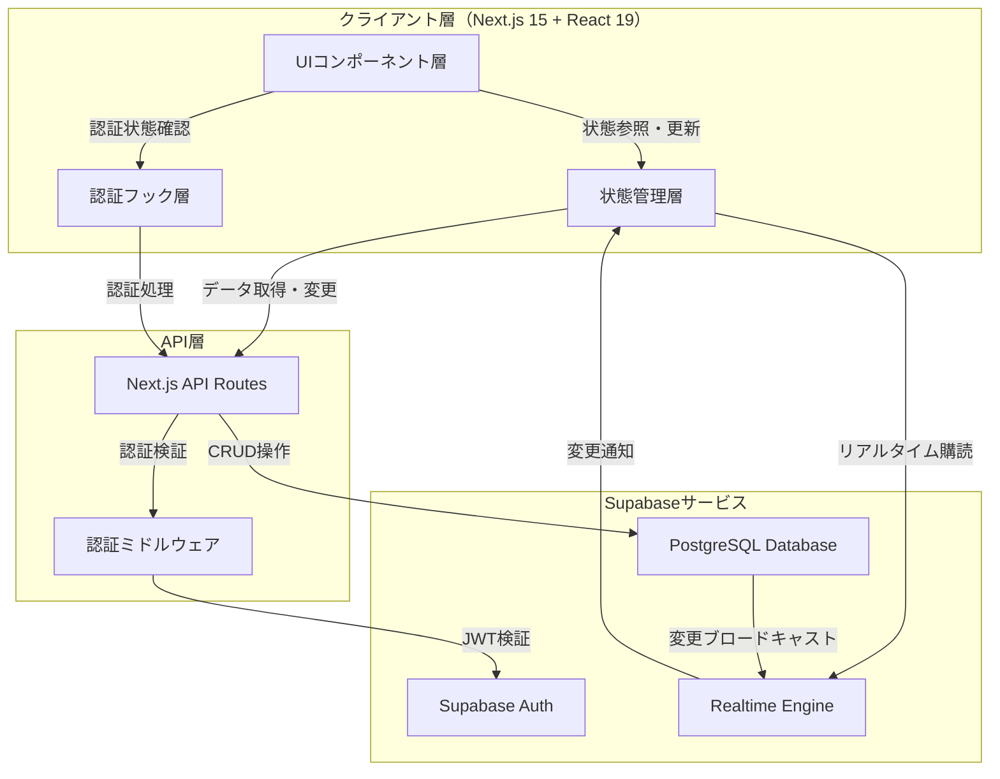

# cc-sddワークフローパターンとベストプラクティス

このドキュメントでは、cc-sddを使用した開発における具体的なワークフローパターン、実践的なベストプラクティス、および頻出する問題への対処法を詳細に解説します。

## 目次

1. [ワークフローパターン](#1-ワークフローパターン)
2. [フェーズ別ベストプラクティス](#2-フェーズ別ベストプラクティス)
3. [チーム開発でのcc-sdd活用](#3-チーム開発でのcc-sdd活用)
4. [実践的なTips](#4-実践的なtips)
5. [アンチパターンと回避策](#5-アンチパターンと回避策)

---

## 1. ワークフローパターン

### 1.1 新規プロジェクト開発パターン

#### シナリオ
ゼロから新しいプロジェクトを開始する場合

#### ワークフロー

```mermaid
graph TB
    A[プロジェクト構想] --> B[cc-sddインストール]
    B --> C[/kiro:steering]
    C --> D[ステアリングレビュー]
    D --> E[/kiro:spec-init]
    E --> F[/kiro:spec-requirements]
    F --> G{要件OK?}
    G -->|No| H[requirements.md編集]
    H --> G
    G -->|Yes| I[spec.json承認]
    I --> J[/kiro:spec-design]
    J --> K[/kiro:validate-design]
    K --> L{設計OK?}
    L -->|No| M[design.md編集]
    M --> L
    L -->|Yes| N[spec.json承認]
    N --> O[/kiro:spec-tasks]
    O --> P{タスクOK?}
    P -->|No| Q[tasks.md編集]
    Q --> P
    P -->|Yes| R[spec.json承認]
    R --> S[/kiro:spec-impl]
    S --> T[テスト実行]
    T --> U[/kiro:validate-gap]
    U --> V{ギャップあり?}
    V -->|Yes| W[追加実装]
    W --> T
    V -->|No| X[デプロイ]
```

#### 詳細ステップ

**Phase 0: 準備（30分 - 1時間）**

1. プロジェクトディレクトリを作成
   ```bash
   mkdir my-new-project
   cd my-new-project
   git init
   ```

2. cc-sddをインストール
   ```bash
   npx cc-sdd@latest --lang ja
   ```

3. ステアリングを作成
   ```bash
   /kiro:steering
   ```
   - プロダクトの概要を明確に説明
   - 技術スタックを決定（フレームワーク、ライブラリ、DB）
   - プロジェクト構造のパターンを定義

4. ステアリングをレビュー・編集
   - `.kiro/steering/product.md` - プロダクトビジョンを確認
   - `.kiro/steering/tech.md` - 技術選定の妥当性を確認
   - `.kiro/steering/structure.md` - ディレクトリ構造を確認

5. 初回コミット
   ```bash
   git add .
   git commit -m "chore: setup cc-sdd steering documents"
   ```

**Phase 1: 仕様策定（2-4時間）**

6. スペックを初期化
   ```bash
   /kiro:spec-init [詳細なプロジェクト説明]
   ```

7. 要件定義を生成
   ```bash
   /kiro:spec-requirements [feature-name]
   ```

8. 要件をレビュー
   - 全ての主要機能が網羅されているか
   - Acceptance Criteriaが具体的か
   - 優先順位が明確か

9. 必要に応じて`requirements.md`を編集

10. 要件を承認
    ```json
    // .kiro/specs/[feature-name]/spec.json
    {
      "approvals": {
        "requirements": {
          "generated": true,
          "approved": true
        }
      }
    }
    ```

11. コミット
    ```bash
    git add .
    git commit -m "docs: add requirements for [feature-name]"
    ```

12. 設計を生成
    ```bash
    /kiro:spec-design [feature-name] -y
    ```

13. 設計をレビュー
    - アーキテクチャが要件を満たしているか
    - 技術選定が適切か
    - データモデルが正規化されているか

14. 設計を検証（オプション）
    ```bash
    /kiro:validate-design [feature-name]
    ```

15. 必要に応じて`design.md`を編集

16. 設計を承認
    ```json
    {
      "approvals": {
        "design": {
          "generated": true,
          "approved": true
        }
      }
    }
    ```

17. コミット
    ```bash
    git add .
    git commit -m "docs: add design for [feature-name]"
    ```

18. タスクを生成
    ```bash
    /kiro:spec-tasks [feature-name] -y
    ```

19. タスクをレビュー
    - タスクの粒度が適切か
    - 依存関係が明確か
    - 全要件がカバーされているか

20. 必要に応じて`tasks.md`を編集

21. タスクを承認
    ```json
    {
      "approvals": {
        "tasks": {
          "generated": true,
          "approved": true
        }
      },
      "ready_for_implementation": true
    }
    ```

22. コミット
    ```bash
    git add .
    git commit -m "docs: add implementation tasks for [feature-name]"
    ```

**Phase 2: 実装（1-3日）**

23. 実装を開始
    ```bash
    /kiro:spec-impl [feature-name]
    ```

24. 各タスク完了時にコミット
    ```bash
    git add .
    git commit -m "feat: implement task X.Y - [task title]"
    ```

25. 定期的にテストを実行
    ```bash
    npm test
    npm run test:e2e
    ```

26. ギャップ検証
    ```bash
    /kiro:validate-gap [feature-name]
    ```

27. 未実装機能があれば追加実装

28. 最終コミット
    ```bash
    git add .
    git commit -m "feat: complete implementation of [feature-name]"
    ```

**Phase 3: デプロイ（30分 - 1時間）**

29. ビルド確認
    ```bash
    npm run build
    ```

30. パフォーマンス計測
    ```bash
    npm run perf:lighthouse
    ```

31. デプロイ
    ```bash
    vercel --prod
    ```

---

### 1.2 既存プロジェクトへの機能追加パターン

#### シナリオ
既存のプロジェクトに新しい機能を追加する場合

#### ワークフロー

```mermaid
graph TB
    A[既存プロジェクト] --> B{ステアリングあり?}
    B -->|No| C[/kiro:steering]
    B -->|Yes| D{ステアリング最新?}
    C --> E[/kiro:spec-init]
    D -->|No| F[ステアリング更新]
    D -->|Yes| E
    F --> E
    E --> G[/kiro:spec-requirements]
    G --> H[既存コードとの整合性確認]
    H --> I[/kiro:spec-design]
    I --> J[既存アーキテクチャとの統合確認]
    J --> K[/kiro:spec-tasks]
    K --> L[/kiro:spec-impl]
    L --> M[既存テストの実行]
    M --> N{全テストパス?}
    N -->|No| O[修正]
    O --> M
    N -->|Yes| P[/kiro:validate-gap]
    P --> Q[デプロイ]
```

#### 詳細ステップ

**Phase 0: 既存プロジェクトの把握（30分 - 1時間）**

1. プロジェクトの現状を確認
   ```bash
   # ディレクトリ構造を確認
   ls -R

   # 依存関係を確認
   cat package.json

   # ビルドが成功するか確認
   npm run build

   # テストが全てパスするか確認
   npm test
   ```

2. ステアリングの有無を確認
   ```bash
   ls .kiro/steering/
   ```

3. ステアリングがない、または古い場合は更新
   ```bash
   /kiro:steering
   ```
   - 既存の技術スタックを正確に記述
   - 既存のプロジェクト構造を反映
   - コーディング規約を明記

4. コミット
   ```bash
   git add .
   git commit -m "chore: update steering documents"
   ```

**Phase 1: 新機能の仕様策定（1-2時間）**

5. 新機能のスペックを初期化
   ```bash
   /kiro:spec-init [新機能の詳細説明]
   ```
   - 既存機能との関連を明記
   - 既存コードへの影響範囲を説明

6. 要件定義を生成
   ```bash
   /kiro:spec-requirements [new-feature]
   ```

7. 既存機能との整合性を確認
   - 既存の要件と矛盾しないか
   - 既存のユーザーフローを壊さないか
   - 後方互換性が保たれるか

8. 要件を承認

9. 設計を生成
   ```bash
   /kiro:spec-design [new-feature] -y
   ```

10. 既存アーキテクチャとの統合を確認
    - 既存のデータモデルと整合するか
    - 既存のAPIエンドポイントと衝突しないか
    - 既存のコンポーネント構成に適合するか

11. 設計を承認

12. タスクを生成
    ```bash
    /kiro:spec-tasks [new-feature] -y
    ```

13. 既存コードへの影響を考慮してタスクを調整
    - 既存コードの修正が必要な箇所を特定
    - マイグレーションが必要なデータを洗い出し
    - 既存テストの更新を含める

14. タスクを承認

**Phase 2: 実装（1-2日）**

15. ブランチを作成
    ```bash
    git checkout -b feature/[new-feature]
    ```

16. 実装を開始
    ```bash
    /kiro:spec-impl [new-feature]
    ```

17. 既存テストを頻繁に実行
    ```bash
    npm test
    ```
    - 既存機能を壊していないか確認

18. 各タスク完了時にコミット

19. ギャップ検証
    ```bash
    /kiro:validate-gap [new-feature]
    ```

20. Pull Requestを作成
    ```bash
    git push origin feature/[new-feature]
    gh pr create --title "feat: add [new-feature]" --body "..."
    ```

21. CIが成功することを確認

22. レビュー後、mainにマージ

---

### 1.3 大規模リファクタリングパターン

#### シナリオ
既存コードベースの大規模なリファクタリングを行う場合

#### ワークフロー

```mermaid
graph TB
    A[リファクタリング計画] --> B[/kiro:steering更新]
    B --> C[/kiro:spec-init]
    C --> D[/kiro:spec-requirements]
    D --> E[現状分析とギャップ特定]
    E --> F[/kiro:spec-design]
    F --> G[移行戦略の定義]
    G --> H[/kiro:spec-tasks]
    H --> I[段階的実装計画]
    I --> J[Phase 1実装]
    J --> K[全テスト実行]
    K --> L{Phase 1成功?}
    L -->|No| M[ロールバック]
    M --> J
    L -->|Yes| N[Phase 2実装]
    N --> O[全テスト実行]
    O --> P{Phase 2成功?}
    P -->|No| Q[ロールバック]
    Q --> N
    P -->|Yes| R[Phase 3...]
    R --> S[完了]
```

#### 詳細ステップ

**Phase 0: 計画（1-2日）**

1. リファクタリングの目的を明確化
   - パフォーマンス改善
   - 保守性向上
   - 技術的負債の解消
   - 新機能追加の準備

2. 現状の問題点を洗い出し
   - コードの複雑度を計測
   - テストカバレッジを確認
   - パフォーマンスボトルネックを特定

3. ステアリングを更新
   ```bash
   /kiro:steering
   ```
   - リファクタリング後の目標アーキテクチャを記述
   - 採用する新しい技術やパターンを説明

4. スペックを初期化
   ```bash
   /kiro:spec-init [リファクタリングの詳細説明]
   ```
   - 現状の問題点を明記
   - 期待する改善結果を具体的に記述

5. 要件定義を生成
   ```bash
   /kiro:spec-requirements [refactoring-name]
   ```
   - 非機能要件（パフォーマンス、保守性）を重視
   - 既存機能の動作を変更しないことを明記

6. 設計を生成
   ```bash
   /kiro:spec-design [refactoring-name] -y
   ```
   - Before/Afterのアーキテクチャ図を含める
   - 移行戦略を詳細に記述

7. 設計を検証
   ```bash
   /kiro:validate-design [refactoring-name]
   ```

**Phase 1: 段階的実装計画（1日）**

8. タスクを生成
   ```bash
   /kiro:spec-tasks [refactoring-name] -y
   ```

9. タスクを段階（Phase）に分割
   - Phase 1: 準備（テスト追加、依存関係整理）
   - Phase 2: コア部分のリファクタリング
   - Phase 3: 周辺部分のリファクタリング
   - Phase 4: 最適化と古いコードの削除

10. 各Phaseごとにブランチ戦略を定義
    ```bash
    # Phase 1
    git checkout -b refactor/phase-1-preparation

    # Phase 2
    git checkout -b refactor/phase-2-core

    # Phase 3
    git checkout -b refactor/phase-3-peripherals

    # Phase 4
    git checkout -b refactor/phase-4-cleanup
    ```

**Phase 2: 段階的実装（1-2週間）**

11. Phase 1を実装
    ```bash
    /kiro:spec-impl [refactoring-name] 1
    ```

12. テストカバレッジを向上
    ```bash
    npm test -- --coverage
    ```
    - カバレッジ80%以上を目指す

13. Phase 1をコミット
    ```bash
    git add .
    git commit -m "refactor(phase-1): add tests and prepare for refactoring"
    ```

14. Phase 1のPRを作成してマージ

15. Phase 2を実装
    ```bash
    /kiro:spec-impl [refactoring-name] 2
    ```

16. 既存テストが全てパスすることを確認
    ```bash
    npm test
    npm run test:e2e
    ```

17. パフォーマンスベンチマークを実行
    ```bash
    npm run perf:benchmark
    ```

18. Phase 2をコミットしてマージ

19. 同様にPhase 3、Phase 4を実装

**Phase 3: 検証とクリーンアップ（1-2日）**

20. ギャップ検証
    ```bash
    /kiro:validate-gap [refactoring-name]
    ```

21. パフォーマンス改善を計測
    ```bash
    npm run perf:lighthouse
    ```

22. コードレビューとドキュメント更新

23. 最終デプロイ

---

## 2. フェーズ別ベストプラクティス

### 2.1 Phase 0: ステアリング作成のベストプラクティス

#### 具体的で詳細な説明を心がける

**悪い例**:
```markdown
# product.md
ToDoアプリを作ります。
```

**良い例**:
```markdown
# product.md

## Product Description
cc-sdd (Claude Code Spec-Driven Development) は、Claude Code向けのKiro風仕様駆動開発実装です。スラッシュコマンド、フック、エージェントを活用した開発プロセスを提供します。

## Core Features
- **仕様駆動開発**: 要件定義 → 設計 → タスク生成 → 実装という段階的な開発フロー
- **ステアリングドキュメント管理**: プロジェクト全体のルールとコンテキストをAIに提供
- **スペック管理**: 個別機能ごとの開発プロセスを形式化

## Target Use Case
- AI支援開発における「最適化されていないコード」や「どうなっているんだっけ?」という問題の解決
- 大規模な実装における不安の解消と品質向上
```

#### 技術選定の理由を明記する

**悪い例**:
```markdown
# tech.md
Next.js, React, Supabaseを使います。
```

**良い例**:
```markdown
# tech.md

## Core Technologies

### Next.js 15 (App Router)
- **選定理由**: React 19完全サポート、Turbopack成熟による高速ビルド
- **代替案**: Vite + React、Remix
- **選定根拠**: SSR/SSG/ISRの柔軟な選択、Supabase公式ドキュメントの充実したNext.js統合ガイド

### Supabase
- **選定理由**: 認証・DB・リアルタイム通信を統合したBaaS
- **代替案**: Firebase、AWS Amplify、自前でPostgreSQL + Auth0
- **選定根拠**: PostgreSQLベースで複雑なクエリに対応、Row Level Security (RLS)による細かいアクセス制御
```

#### プロジェクト構造を明確に定義する

**良い例**:
```markdown
# structure.md

## Root Directory Organization

```
/
├── app/                        # Next.js App Router
│   ├── (auth)/                 # 認証関連ルート
│   │   ├── login/
│   │   └── signup/
│   └── board/                  # カンバンボードルート
├── components/                 # UIコンポーネント
│   ├── ui/                     # shadcn/uiコンポーネント
│   ├── auth/                   # 認証コンポーネント
│   └── board/                  # ボードコンポーネント
├── lib/                        # ユーティリティ
│   ├── supabase/               # Supabaseクライアント
│   └── utils/                  # ヘルパー関数
├── services/                   # ビジネスロジック
│   ├── auth.service.ts
│   ├── board.service.ts
│   └── task.service.ts
├── stores/                     # Zustand状態管理
│   └── board.store.ts
├── types/                      # 型定義
│   ├── database.types.ts
│   └── models.ts
└── __tests__/                  # テスト
    ├── unit/
    ├── integration/
    └── e2e/
```
```

---

### 2.2 Phase 1: 仕様策定のベストプラクティス

#### 要件定義: ユーザー視点で記述する

**悪い例**:
```markdown
### Requirement 1: データベース
PostgreSQLにtasksテーブルを作成する。
```

**良い例**:
```markdown
### Requirement 1: タスクの作成と編集
**Objective:** ユーザーとして、タスクを作成・編集し、必要な情報を記録したい。そうすることで、タスクの詳細を管理し、作業内容を明確にする。

#### Acceptance Criteria
1. WHEN ユーザーが列内の「+タスクを追加」ボタンをクリックする THEN カンバンToDoアプリ SHALL タスク作成フォームを表示する
2. WHEN ユーザーがタスク作成フォームでタイトルを入力し保存する THEN カンバンToDoアプリ SHALL 新しいタスクカードをその列に追加し、Supabaseデータベースに保存する
```

#### 設計: アーキテクチャ図を含める

**良い例**:
```markdown
## High-Level Architecture


```

#### タスク分解: 適切な粒度を保つ

**悪い例（粒度が大きすぎる）**:
```markdown
- [ ] 1. アプリケーション全体を実装する
```

**悪い例（粒度が小さすぎる）**:
```markdown
- [ ] 1.1 package.jsonを作成する
- [ ] 1.2 tsconfig.jsonを作成する
- [ ] 1.3 tailwind.config.jsを作成する
- [ ] 1.4 next.config.jsを作成する
```

**良い例（1-2時間で完了可能）**:
```markdown
- [ ] 1.1 Next.js 15プロジェクトの初期化とTypeScript設定
  - Next.js 15とReact 19をインストールし、App Routerを有効化
  - TypeScript 5.xの設定ファイルを作成し、厳格な型チェックを有効化
  - Tailwind CSS 4.xをインストールし、基本的なデザイントークンを設定
  - shadcn/uiを初期化し、components.jsonを設定
  - ESLintとPrettierの設定を追加し、コード品質を確保
  - _Requirements: 全要件に共通する基盤_
```

---

### 2.3 Phase 2: 実装のベストプラクティス

#### TDD（Test-Driven Development）を採用する

**ワークフロー**:
1. テストを先に書く
2. テストを実行（失敗することを確認）
3. 実装を書く
4. テストを実行（成功することを確認）
5. リファクタリング

**例**:
```typescript
// 1. テストを先に書く
// __tests__/services/task.service.test.ts
import { describe, it, expect } from 'vitest'
import { TaskService } from '@/services/task.service'

describe('TaskService.createTask', () => {
  it('should create a task with title', async () => {
    const task = await TaskService.createTask({
      columnId: 'col-1',
      title: 'Test Task',
      description: 'Test Description'
    })
    expect(task.title).toBe('Test Task')
    expect(task.description).toBe('Test Description')
  })
})

// 2. テストを実行（失敗）
// npm test

// 3. 実装を書く
// services/task.service.ts
export class TaskService {
  static async createTask(data: CreateTaskDTO): Promise<Task> {
    const { data: task, error } = await supabase
      .from('tasks')
      .insert(data)
      .select()
      .single()

    if (error) throw error
    return task
  }
}

// 4. テストを実行（成功）
// npm test
```

#### 頻繁にコミットする

**良い例**:
```bash
# タスク1.1完了
git add .
git commit -m "chore: setup Next.js 15 project with TypeScript and Tailwind"

# タスク1.2完了
git add .
git commit -m "feat: setup Supabase client and environment variables"

# タスク1.3完了
git add .
git commit -m "feat: create database schema and RLS policies"
```

**悪い例**:
```bash
# 全タスク完了後に1回だけコミット
git add .
git commit -m "implement everything"
```

#### 楽観的UI更新を実装する

ユーザーエクスペリエンスを向上させるため、API呼び出し前にUIを更新します。

**例**:
```typescript
// stores/board.store.ts
export const useBoardStore = create<BoardStore>((set, get) => ({
  tasks: [],

  moveTask: async (taskId: string, newColumnId: string, newPosition: number) => {
    const originalTasks = get().tasks

    // 1. 楽観的にUI更新
    set((state) => ({
      tasks: state.tasks.map(task =>
        task.id === taskId
          ? { ...task, columnId: newColumnId, position: newPosition }
          : task
      )
    }))

    try {
      // 2. APIを呼び出す
      await TaskService.moveTask(taskId, newColumnId, newPosition)
    } catch (error) {
      // 3. エラー時にロールバック
      set({ tasks: originalTasks })
      toast.error('タスクの移動に失敗しました')
    }
  }
}))
```

---

## 3. チーム開発でのcc-sdd活用

### 3.1 ロールの分担

#### プロダクトオーナー
- ステアリング（product.md）の作成・維持
- 要件定義（requirements.md）のレビューと承認
- 優先順位の決定

#### アーキテクト
- ステアリング（tech.md, structure.md）の作成・維持
- 設計（design.md）のレビューと承認
- 技術選定の意思決定

#### 開発者
- タスク（tasks.md）のレビューと承認
- 実装（spec-impl）の実行
- テストの作成と実行

### 3.2 ブランチ戦略

#### GitFlowパターン

```
main
  ├── develop
  │   ├── feature/user-auth
  │   ├── feature/kanban-board
  │   └── feature/task-management
  └── release/v1.0.0
```

**ワークフロー**:
1. `develop`ブランチから機能ブランチを作成
   ```bash
   git checkout develop
   git checkout -b feature/[feature-name]
   ```

2. 仕様策定と実装
   ```bash
   /kiro:spec-init [feature-name]
   # ... 要件定義、設計、タスク ...
   /kiro:spec-impl [feature-name]
   ```

3. PRを作成して`develop`にマージ
   ```bash
   git push origin feature/[feature-name]
   gh pr create --base develop --title "feat: [feature-name]"
   ```

4. リリース準備ができたら`release`ブランチを作成
   ```bash
   git checkout develop
   git checkout -b release/v1.0.0
   ```

5. `release`を`main`にマージしてデプロイ

### 3.3 コードレビューのチェックリスト

#### 仕様レビュー（requirements.md, design.md）

- [ ] 要件が全て網羅されているか
- [ ] Acceptance Criteriaが具体的で測定可能か
- [ ] 設計がアーキテクチャガイドラインに準拠しているか
- [ ] セキュリティ考慮事項が含まれているか
- [ ] パフォーマンス最適化戦略が定義されているか

#### コードレビュー（実装）

- [ ] タスクの実装が完了しているか
- [ ] テストが追加されているか
- [ ] テストが全てパスしているか
- [ ] コードが設計通りか
- [ ] コーディング規約に準拠しているか
- [ ] 適切なエラーハンドリングがあるか
- [ ] 適切なロギングがあるか
- [ ] ドキュメントが更新されているか

---

## 4. 実践的なTips

### 4.1 効率的な仕様策定

#### Tip 1: テンプレートを活用する

よく使うプロジェクトパターンのテンプレートを作成しておきます。

**例: SaaS Webアプリテンプレート**

```bash
# .kiro/templates/saas-web-app/steering/
# - product.md
# - tech.md (Next.js + Supabase + Tailwind)
# - structure.md

# 新プロジェクト開始時
cp -r .kiro/templates/saas-web-app/steering/* .kiro/steering/
```

#### Tip 2: 要件定義を段階的に詳細化する

最初は高レベルな要件を定義し、設計フェーズで詳細化します。

**Phase 1: 高レベル要件**
```markdown
### Requirement 1: ユーザー認証
ユーザーがアカウントを作成してログインできる。
```

**Phase 2: 詳細化（設計レビュー後）**
```markdown
### Requirement 1: ユーザー認証
**Objective:** ユーザーとして、安全にアカウントを作成・ログインし、個人のタスク管理環境にアクセスしたい。

#### Acceptance Criteria
1. WHEN ユーザーが新規登録フォームでメールアドレスとパスワードを入力し送信する...
2. WHEN ユーザーが確認メール内のリンクをクリックする...
...
```

#### Tip 3: 設計図をAIに描かせる

Mermaidダイアグラムを自動生成してもらい、後で調整します。

```markdown
## High-Level Architecture

[AIに依頼]
「Next.js、Supabase、Zustandを使用したカンバンボードアプリのHigh-Level Architectureを
Mermaidで図示してください。クライアント層、API層、Supabaseサービス層を含めてください。」
```

### 4.2 実装の加速

#### Tip 4: shadcn/uiでUI開発を高速化

事前に必要なコンポーネントを一括インストールします。

```bash
# よく使うコンポーネントを一括インストール
npx shadcn@latest add button dialog input textarea select \
  card dropdown-menu popover toast label form checkbox \
  radio-group switch slider tabs accordion alert
```

#### Tip 5: Supabase CLIでローカル開発環境を構築

ローカルでSupabaseを実行し、本番環境を汚さずに開発します。

```bash
# Supabase CLIをインストール
npm install -g supabase

# ローカルSupabaseを起動
supabase init
supabase start

# マイグレーションを作成
supabase migration new create_tables

# マイグレーションを適用
supabase db reset

# 本番環境にマイグレーションを適用
supabase db push
```

#### Tip 6: TypeScript型を自動生成

Supabaseからデータベース型を自動生成します。

```bash
# 型定義を生成
supabase gen types typescript --local > types/database.types.ts

# package.jsonにスクリプト追加
{
  "scripts": {
    "db:types": "supabase gen types typescript --local > types/database.types.ts"
  }
}
```

### 4.3 デバッグとトラブルシューティング

#### Tip 7: SupabaseダッシュボードでRLSをテスト

```sql
-- RLSポリシーをテスト
SELECT * FROM tasks WHERE user_id = auth.uid();

-- 特定のユーザーでテスト
SELECT * FROM tasks WHERE user_id = '12345678-1234-1234-1234-123456789012';
```

#### Tip 8: React DevToolsでZustand状態を監視

```typescript
// stores/board.store.ts
import { create } from 'zustand'
import { devtools } from 'zustand/middleware'

export const useBoardStore = create(
  devtools(
    (set) => ({
      tasks: [],
      // ...
    }),
    { name: 'BoardStore' }
  )
)
```

#### Tip 9: Playwrightのトレース機能でE2Eテストをデバッグ

```bash
# トレース付きでE2Eテスト実行
npx playwright test --trace on

# トレースを表示
npx playwright show-trace trace.zip
```

---

## 5. アンチパターンと回避策

### 5.1 アンチパターン1: ステアリングをスキップする

#### 問題
ステアリングを作成せずに仕様策定を開始すると、AIがプロジェクトのコンテキストを理解できず、不適切な設計や技術選定を提案する。

#### 症状
- 要件定義が曖昧
- 設計が既存のアーキテクチャと整合しない
- タスクが実行不可能

#### 回避策
小さな機能追加であっても、最低限の`tech.md`と`structure.md`を用意する。

```bash
# 既存プロジェクトに機能を追加する前に
/kiro:steering
```

---

### 5.2 アンチパターン2: 要件を承認せずに設計に進む

#### 問題
要件が固まっていない状態で設計を開始すると、後で大幅な手戻りが発生する。

#### 症状
- 設計の途中で要件が変わる
- 実装中に「この機能は要件に含まれていない」と気づく

#### 回避策
`spec.json`で各フェーズを明示的に承認する。

```json
{
  "approvals": {
    "requirements": {
      "generated": true,
      "approved": true  // ← 必ず承認してから次に進む
    }
  }
}
```

---

### 5.3 アンチパターン3: タスクを一括実装しようとする

#### 問題
全タスクを一度に実装しようとすると、途中でエラーが発生した時に原因箇所の特定が困難になる。

#### 症状
- ビルドエラーが大量に発生
- テストが全て失敗
- どこから修正すればいいかわからない

#### 回避策
タスクを段階的に実装し、各タスク完了時にテストを実行する。

```bash
# タスクを1つずつ実装
/kiro:spec-impl kanban-todo-app 1.1
npm test

/kiro:spec-impl kanban-todo-app 1.2
npm test

/kiro:spec-impl kanban-todo-app 1.3
npm test
```

---

### 5.4 アンチパターン4: テストを書かない

#### 問題
テストがないと、リファクタリングや機能追加時に既存機能を壊してしまう。

#### 症状
- デプロイ後にバグが発覚
- リファクタリングが怖い
- 機能追加のたびに既存機能が壊れる

#### 回避策
実装と同時にテストを書く。TDDを採用する。

```markdown
# tasks.mdにテストタスクを含める
- [ ] 2.1 Supabase Auth統合と認証サービスの作成
- [ ] 2.1.1 認証サービスのユニットテストを作成
- [ ] 2.1.2 認証サービスを実装
```

---

### 5.5 アンチパターン5: ドキュメントを更新しない

#### 問題
実装中に仕様が変わっても、`requirements.md`や`design.md`を更新しないと、ドキュメントと実装が乖離する。

#### 症状
- `/kiro:validate-gap`で大量のギャップが検出
- 新メンバーがドキュメントを読んでも理解できない

#### 回避策
仕様変更があったら、即座にドキュメントを更新する。

```bash
# 実装中に仕様変更があった
# 1. requirements.mdを編集
vim .kiro/specs/kanban-todo-app/requirements.md

# 2. design.mdを編集
vim .kiro/specs/kanban-todo-app/design.md

# 3. コミット
git add .
git commit -m "docs: update requirements and design based on implementation feedback"
```

---

## まとめ

このドキュメントでは、cc-sddを使用した開発における様々なワークフローパターンとベストプラクティスを解説しました。

**重要なポイント**:

1. **ステアリングを最初に作成**: プロジェクトのコンテキストをAIに理解させる
2. **各フェーズで人間がレビュー**: 品質を保つために承認プロセスを守る
3. **段階的に実装**: タスクを細かく分割し、頻繁にテストする
4. **ドキュメントを常に最新に**: 実装とドキュメントの乖離を防ぐ
5. **チームで共有**: スペックを共有し、一貫した開発を実現

これらのパターンを参考に、あなたのプロジェクトに最適なワークフローを構築してください。
